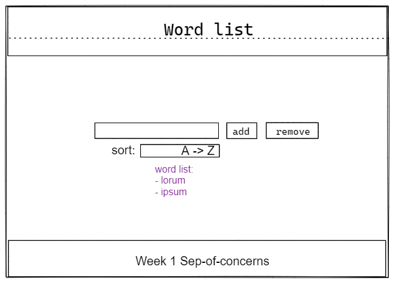

# Word list

A program that creates a list of words that the user add adn can be sorted in many ways

## 0.Setup

- [x] [fork repo](https://github.com/rago89/word-list) (with a complete README)
- [x] [live demo](https://_.github.io/_)
- [x] [Docs](https://github.com/rago89/word-list/blob/master/DOCS.md)
- [/planning](https://github.com/rago89/word-list/tree/master/planning)
  - [x] constraints
  - [x] backlog
  - [x] wireframe
  - [x] development strategy
  - [x] retrospective
- [x] [project board](https://github.com/rago89/word-list/projects/1)

## User Story Dependencies

[Story Dependency Diagram](./../public/images/storie-dependencies.png)

---

## WIREFRAME

